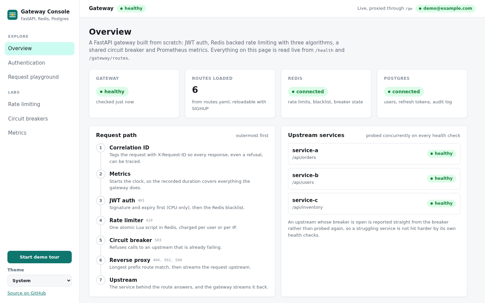
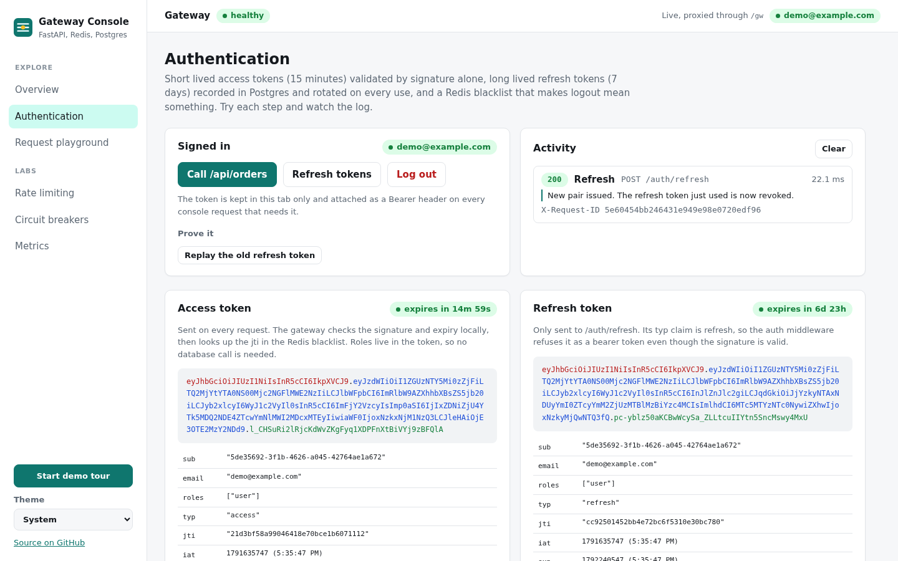
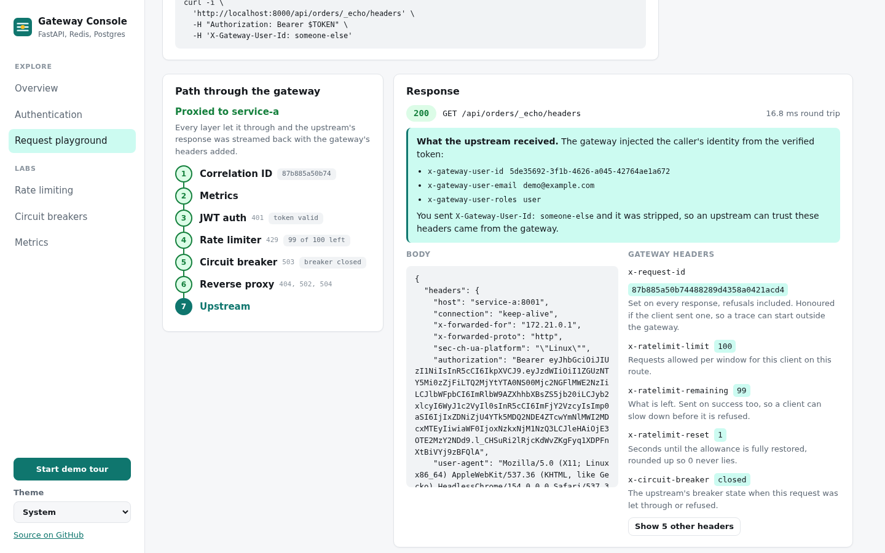
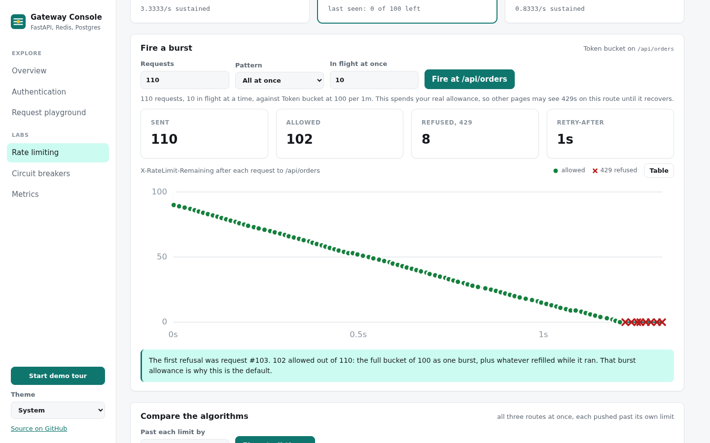
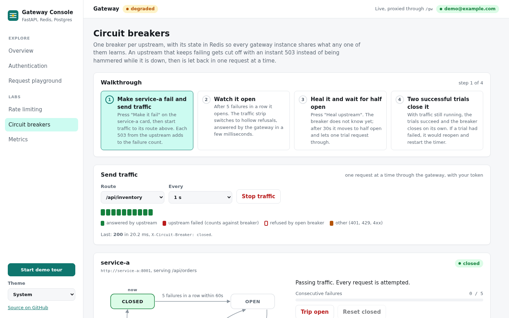
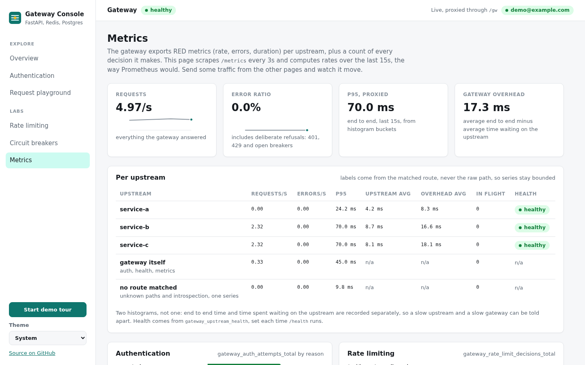

# API Gateway with Auth, Rate Limiting and Observability

A production-shaped API gateway built from scratch with FastAPI. Reverse
proxying, JWT authentication, Redis-backed rate limiting with three algorithm
implementations, a circuit breaker, and full Prometheus observability. No Kong,
no AWS API Gateway. The internals are built by hand.

> **Domain:** Backend infrastructure and platform engineering
> **Stack:** FastAPI, Redis, JWT, PostgreSQL, Prometheus, Grafana, Docker Compose
> **Tests:** 563 passing, including integration tests against real Redis and Postgres

---

## Table of Contents

- [System Overview](#system-overview)
- [Architecture](#architecture)
- [Project Structure](#project-structure)
- [Architecture and Design Decisions](#architecture-and-design-decisions)
- [Getting Started](#getting-started)
- [Gateway Console](#gateway-console)
- [API Reference](#api-reference)
- [Development](#development)
- [Benchmark Results](#benchmark-results)
- [How I Would Scale This](#how-i-would-scale-this)
- [What I Would Do Differently](#what-i-would-do-differently)

---

## System Overview

```
Client
  |
  | HTTP request
  v
API Gateway (FastAPI)
  |
  |-- Correlation ID      X-Request-ID, generated or honoured
  |-- Metrics             timing starts here, so it covers everything below
  |-- JWT auth            signature, expiry, then blacklist
  |-- Rate limiter        Redis + Lua, per user or per IP
  |-- Circuit breaker     refuses if the upstream is already failing
  |
  | route match, longest prefix first
  v
Upstream service
  |
  v
Response, streamed back with gateway headers added
```

The middleware order is deliberate and explained in
[Decision 7](#decision-7-middleware-ordering).

---

## Architecture

| Component | Role |
|---|---|
| FastAPI gateway | Routing, middleware chain, reverse proxy |
| Redis | Rate limit counters, token blacklist, circuit breaker state |
| PostgreSQL | Users, refresh tokens, audit log |
| PyJWT | Access and refresh token issuing and validation |
| Prometheus | RED metrics, breaker state, auth and rate limit decisions |
| Grafana | Pre-provisioned dashboard, no setup clicks |
| Upstream services | Three mock services with fault injection controls |
| Gateway Console | React frontend that drives and explains every feature live |

---

## Project Structure

```
api-gateway/
|
|-- .github/workflows/ci.yml        # lint, tests on 3.10 and 3.11, integration, image build
|
|-- gateway/
|   |-- main.py                     # app factory, lifespan, middleware order, catch-all proxy
|   |-- config.py                   # pydantic-settings, refuses insecure production config
|   |-- proxy.py                    # streaming reverse proxy, hop-by-hop header handling
|   |-- router.py                   # YAML route table, longest prefix match, SIGHUP reload
|   |-- health.py                   # concurrent upstream probes, breaker aware
|   |
|   |-- middleware/
|   |   |-- correlation.py          # X-Request-ID, ContextVar for logging
|   |   |-- auth.py                 # JWT validation, cheapest check first
|   |   |-- rate_limiter.py         # per route limits, standard X-RateLimit headers
|   |   |-- circuit_breaker.py      # refuses calls to upstreams already failing
|   |
|   |-- auth/
|   |   |-- jwt_handler.py          # access and refresh tokens, separated by a typ claim
|   |   |-- passwords.py            # bcrypt directly, see Decision 3
|   |   |-- blacklist.py            # Redis blacklist, makes logout mean something
|   |   |-- blacklist_cache.py      # in-memory cache for the hot path
|   |   |-- service.py              # register, login, refresh with rotation, logout
|   |   |-- routes.py               # the /auth endpoints
|   |
|   |-- rate_limit/
|   |   |-- base.py                 # shared interface, key scheme, fail-open behaviour
|   |   |-- fixed_window.py         # simplest, documented boundary problem
|   |   |-- token_bucket.py         # default, lazy refill
|   |   |-- sliding_window.py       # most precise, highest memory
|   |   |-- factory.py              # algorithm selection, cached per configuration
|   |
|   |-- circuit_breaker/
|   |   |-- breaker.py              # pure state machine, no IO
|   |   |-- store.py                # Redis persistence, atomic transitions
|   |   |-- registry.py             # one breaker per upstream service
|   |   |-- routes.py               # introspection and manual override
|   |
|   |-- metrics/
|   |   |-- prometheus.py           # metric definitions and label rules
|   |   |-- middleware.py           # request rate, errors, duration
|   |   |-- routes.py               # /metrics scrape endpoint
|   |
|   |-- db/                         # models, connection, repositories
|   |-- schemas/                    # request and response models
|
|-- upstream/service_{a,b,c}/       # mock services with /_control fault injection
|-- frontend/                       # Gateway Console: React, TypeScript, Vite
|   |-- src/pages/                  # one page per feature, see Gateway Console below
|   |-- nginx.conf.template         # serves the build, proxies /gw and /upstream
|   |-- scripts/screenshots.mjs     # regenerates docs/screenshots with headless Chrome
|-- alembic/versions/               # 0001 users and refresh tokens, 0002 audit log
|-- tests/                          # 563 tests
|-- load_tests/locustfile.py
|-- scripts/
|   |-- benchmark_algorithms.py     # produces the table below
|   |-- generate_tokens.py          # signed test tokens without the database
|-- prometheus/                     # scrape config and alert rules
|-- grafana/                        # provisioned datasource and dashboard
|-- docker/                         # multi-stage gateway image, shared upstream image
|-- docker-compose.yml              # full stack
|-- docker-compose.test.yml         # Redis and Postgres for the integration suite
|-- routes.yaml                     # the route table
|-- DEVLOG.md                       # daily notes, including what went wrong
|-- docs/screenshots/               # console screenshots used below
```

---

## Architecture and Design Decisions

### Decision 1: Build a gateway instead of configuring one

**Context:** Kong, Traefik and AWS API Gateway are mature and proven. Why build
one?

**Options:** Kong, Traefik, AWS API Gateway, or build from scratch.

**Decision:** Build from scratch.

**Reasoning:** Configuring Kong means writing YAML and learning its plugin
model. That is a useful skill, but it does not answer what a gateway is doing
underneath. Building one forces every question: how does a reverse proxy stream
a response without buffering it, what makes a rate limiter correct under
concurrency, how does a circuit breaker decide to open, and how does it admit
exactly one trial request when it is time to recover.

The answers are in this repository rather than in prose. In production I would
run Kong or Traefik. This is what they abstract away.

**Tradeoffs accepted:**

- Not production hardened. Kong has years of edge case handling this does not.
- No plugin ecosystem.
- HTTP only. WebSocket proxying is not implemented.

---

### Decision 2: Implement three rate limiting algorithms

**Context:** Rate limiting means counting requests per client in a window.
Several algorithms exist with different tradeoffs.

**Decision:** Implement all three, benchmark them, default to token bucket.

**Why all three:** A limiter supporting one algorithm is one configuration
change away from being wrong for a use case. Implementing all three and
measuring them gives numbers instead of opinions, and the
[benchmark](#benchmark-results) is a real script anyone can rerun.

**Why token bucket by default:** It allows a legitimate short burst while
enforcing a sustained rate. Ten requests in one second against a 100 per minute
limit is reasonable client behaviour, and this is the algorithm that agrees.

Fixed window has a boundary problem: 100 requests at 23:59:59 and 100 more at
00:00:01 is 200 requests in two seconds against a 100 per minute limit. Both
windows are individually within limit. There is a test that demonstrates this
happening, rather than a claim that it could.

Sliding window is the most precise and has no boundary artifact, but stores one
entry per request. The benchmark measures that cost: roughly 26 times the
memory per client of the other two at 50 requests each.

| Algorithm | Memory per client | Burst handling | Boundary problem | Precision |
|---|---|---|---|---|
| Fixed window | O(1) | No | Yes | Low |
| Token bucket | O(1) | Yes | No | Medium |
| Sliding window | O(requests in window) | No | No | High |

**Why Lua:** A limiter written as GET, decide, SET is broken under concurrency.
Two simultaneous requests both read the same counter, both conclude they are
under the limit, and both proceed. Redis executes a Lua script atomically, so
the read, the decision and the write cannot interleave. There is an integration
test that fires 50 concurrent requests at a limit of 10 and asserts exactly 10
are allowed.

The scripts also read the clock themselves with `TIME`. An earlier version
fetched the time from Python first and passed it in, which cost an extra round
trip per check. The benchmark showed token bucket running at 57 percent of
fixed window's throughput purely because of that second trip. Redis 5 replicates
a script's effects rather than the script, so calling `TIME` inside one is safe,
and the gap closed to 86 percent.

---

### Decision 3: Access tokens plus refresh tokens

**Context:** How should authentication work at the gateway layer?

**Decision:** Short-lived access token (15 minutes) plus long-lived refresh
token (7 days), with rotation on use.

**Reasoning:** A single long-lived JWT is a liability: if it leaks, it works
until it expires. Short-lived access tokens bound that window to 15 minutes.
The refresh token is sent only on expiry, so it is exposed far less often.

**Token handling:**

- Access token: validated by signature alone, no database lookup per request.
- Refresh token: recorded in Postgres, so revoking one means something.
- Blacklist: Redis, with a TTL matching the token's own expiry.

The blacklist is the part that makes logout real. A JWT is valid until it
expires by design, so without a server-side record, logging out deletes the
token from the client and changes nothing for anyone who copied it.

**Refresh rotation** goes beyond the original plan. Using a refresh token
revokes it and issues a new one, so a stolen copy is worthless once the real
client next refreshes.

**A note on bcrypt:** The plan called for `passlib[bcrypt]`. passlib 1.7.4 is
the current release, has had no release since 2020, and crashes against bcrypt
4.1 and newer: it probes an attribute that no longer exists, then fails a length
check it should handle itself. The choice was pinning bcrypt backwards to keep a
dead abstraction alive, or calling bcrypt directly. This calls bcrypt directly.

The 72 byte limit is enforced as an explicit schema rule rather than truncating
silently, because bcrypt ignores anything past 72 bytes and two long passwords
sharing a prefix would otherwise be interchangeable.

**Tradeoffs accepted:**

- One Redis lookup per authenticated request for the blacklist, reduced by a
  short-lived local cache (see Decision 6).
- Role changes take up to 15 minutes to propagate, since roles live in the token.

---

### Decision 4: Redis-backed circuit breaker

**Context:** If an upstream is down, every request to it waits out a timeout,
holds a connection, and delays that service's recovery.

**States:**

```
CLOSED  ---- 5 failures in 60s ---->  OPEN
OPEN    ---- 30s elapsed        ---->  HALF-OPEN
HALF-OPEN --- 2 successes       ---->  CLOSED
HALF-OPEN --- any failure       ---->  OPEN (timer restarts)
```

**Decision:** State lives in Redis, not in the process.

**Reasoning:** With in-memory state and three gateway instances, a dead upstream
has to fail five times per instance before anyone stops calling it, and any
instance that restarts forgets what it learned. Shared state means one instance
discovering the outage protects all of them. There is a test asserting exactly
that across two independent breaker stores.

**The hard part was HALF-OPEN admitting exactly one request.** If permission is
a read followed by a write, every request arriving the instant the timeout
lapses reads `half_open` and believes it is the trial. That is a thundering herd
aimed at a service that just proved it was unwell. Permission is therefore a
single Lua script that claims the slot by writing a pending state. A test fires
20 concurrent permission requests at a half-open breaker and asserts exactly one
gets through.

That created a second problem: if the process holding the trial dies before
reporting back, the breaker wedges forever. Pending expires after twice the
recovery timeout, and that is tested too.

**What counts as a failure:** 5xx, timeouts, connection errors. Not 4xx. A flood
of malformed client requests is a client problem, and letting it open the
breaker would let any client take a healthy upstream offline for everyone else.

**Breakers are per upstream, not per route.** If one route of a service starts
failing, that is evidence about the process behind all of its routes.

---

### Decision 5: Prometheus metric design

**RED per upstream**, plus the gateway's own decisions:

```
gateway_requests_total{upstream, method, status_code}
gateway_errors_total{upstream, method, error_type}
gateway_request_duration_seconds{upstream, method}      histogram
gateway_upstream_duration_seconds{upstream, method}     histogram
gateway_circuit_breaker_state{upstream}                 0 closed, 1 open, 2 half open
gateway_circuit_breaker_transitions_total{upstream, to_state}
gateway_rate_limit_decisions_total{algorithm, route, decision}
gateway_auth_attempts_total{result, reason}
gateway_degraded_operations_total{component, reason}
gateway_upstream_health{upstream}
```

**Histogram, not summary.** Summaries compute quantiles inside the process, so
the p95 from three instances cannot be combined; there is no correct way to
average a percentile. Histograms ship bucket counts and Prometheus does the
quantile server side. With more than one instance this is the only correct
choice.

The buckets are hand-picked rather than the library defaults. The default set
tops out at 10 seconds with ten buckets, which is far too coarse: a healthy
proxied request costs single-digit milliseconds and lands entirely in the first
bucket. These are dense below 100ms with a tail to 30 seconds.

**Two duration histograms, not one.** End-to-end time and time spent waiting on
the upstream are recorded separately, so the difference is the gateway's own
overhead. With a single metric, a slow upstream and a slow gateway are
indistinguishable.

**Cardinality.** Every distinct label combination is a time series held in
memory, and unbounded labels are how a Prometheus server dies. The request path
is never a label, because anyone can request any URL; the matched route is used
instead, and unmatched requests collapse into one bucket. A test walks every
exported series and asserts no label value contains a request path.

**The dashboard and alerts are tested.** A panel querying a metric that does not
exist renders an empty graph that looks like an outage. An alert on one never
fires at all. Tests extract every `gateway_*` reference from the dashboard JSON
and the alert rules and assert each is actually registered.

---

### Decision 6: Failing open, and saying so

Three components depend on Redis and choose to fail open when it is
unreachable: the token blacklist, the rate limiters, and breaker permission
checks.

Failing closed would mean rejecting every authenticated request the moment
Redis blips, turning a cache outage into a total outage. Failing open accepts
tokens that are still signature-valid and unexpired, which is bounded by the 15
minute access token TTL.

The risk with failing open is that it is silent. `gateway_degraded_operations_total`
counts every time it happens, labelled by component, so it can be alerted on
rather than discovered afterwards in logs.

The blacklist also keeps a short-lived in-memory cache. At high request rates
every instance reads the same blacklist keys, which is a hot key problem in
Redis. The cache absorbs repeated checks for the same token, so 50 requests with
one token cost one Redis lookup instead of 50. Failures are never cached, and
the cache is capped so it cannot be driven into a memory leak. The cost is a
few seconds where a revoked token may still be accepted.

---

### Decision 7: Middleware ordering

`add_middleware` stacks in reverse, so the chain runs: correlation, metrics,
auth, rate limit, circuit breaker, proxy.

- **Correlation is outermost** so that even a 401, 429 or 503 carries a request
  ID.
- **Metrics next**, so the duration covers everything the gateway did, which is
  what the client experienced.
- **Rate limiting after auth**, so an authenticated request is charged to its
  user rather than to its address. Limiting by IP when a user is known would put
  everyone behind one office NAT into a shared bucket.
- **The breaker innermost**, because it should only judge an upstream on
  requests that were actually going to reach it. A request rejected for being
  unauthenticated says nothing about the upstream's health.

Each middleware falls through when the path matches no route, so an unknown URL
returns 404 rather than 401 or 429. Answering earlier would leak which paths
exist.

---

## Getting Started

### Prerequisites

Docker and Docker Compose. Python 3.11 if you want to run the tests directly.

### 1. Clone and configure

```bash
git clone https://github.com/MuneebKhan06/api-gateway.git
cd api-gateway
cp .env.example .env
```

### 2. Start the stack

```bash
docker compose up -d
```

This starts Redis, Postgres, the gateway, three upstream services, Prometheus,
Grafana and the Gateway Console on `http://localhost:8080`.

### 3. Create the schema

```bash
docker compose run --rm gateway alembic upgrade head
```

Migrations are a separate step rather than an entrypoint, so that replicas do
not race to apply the same migration during a rolling deploy.

### 4. Check it is up

```bash
curl http://localhost:8000/health
```

```json
{
  "status": "healthy",
  "routes_loaded": 6,
  "redis": "connected",
  "database": "connected",
  "upstreams": {"service-a": "healthy", "service-b": "healthy", "service-c": "healthy"}
}
```

### 5. Register and log in

```bash
curl -X POST http://localhost:8000/auth/register \
  -H "Content-Type: application/json" \
  -d '{"email": "you@example.com", "password": "password123"}'

curl -X POST http://localhost:8000/auth/login \
  -H "Content-Type: application/json" \
  -d '{"email": "you@example.com", "password": "password123"}'
```

### 6. Make a proxied request

```bash
export TOKEN="paste-the-access-token"
curl http://localhost:8000/api/orders -H "Authorization: Bearer $TOKEN"
```

The response carries `X-Request-ID`, `X-RateLimit-Remaining` and
`X-Circuit-Breaker`.

### 7. Trigger rate limiting

```bash
for i in $(seq 1 110); do
  curl -s -o /dev/null -w "%{http_code} " \
    http://localhost:8000/api/orders -H "Authorization: Bearer $TOKEN"
done
```

The first 100 return 200, the rest return 429 with a `Retry-After` header.

### 8. Trip the circuit breaker

The mock upstreams can be told to fail, which is how the breaker is exercised
without stopping a container:

```bash
curl -X POST "http://localhost:8001/_control/fail?enabled=true"

for i in $(seq 1 6); do
  curl -s -o /dev/null -w "%{http_code} " \
    http://localhost:8000/api/orders -H "Authorization: Bearer $TOKEN"
done
# 503 503 503 503 503 503, the last few refused by the gateway without calling anything

curl http://localhost:8000/gateway/breakers
curl -X POST "http://localhost:8001/_control/fail?enabled=false"
curl -X POST http://localhost:8000/gateway/breakers/service-a/reset
```

### 9. Look at the dashboard

Grafana is at `http://localhost:3000` and the gateway dashboard is already
loaded. Prometheus is at `http://localhost:9090`.

### 10. Run the benchmark

```bash
docker compose -f docker-compose.test.yml up -d
python scripts/benchmark_algorithms.py --requests 10000 --concurrency 50 --markdown
```

---

## Gateway Console

A browser frontend that exercises the gateway live, so every claim in this
README can be shown rather than described. It talks to a running stack, not
to mocks, and each page explains what just happened and why.

With the stack up, open `http://localhost:8080` and press **Start demo tour**
in the sidebar for a guided walk through every page.



| Page | What it demonstrates |
|---|---|
| Overview | Health of the gateway, Redis, Postgres and each upstream, the middleware order, and the live route table |
| Authentication | Register and log in, decoded access and refresh tokens, refresh rotation (the old refresh token is replayed and refused), and logout (the logged out token is refused by the blacklist) |
| Request playground | Any request through the gateway, with the middleware chain lit up to show which layer answered, every gateway header explained, and what the upstream actually received |
| Rate limiting | Real bursts against each route, a timeline of `X-RateLimit-Remaining`, all three algorithms pushed past their limits at once, and the fixed window boundary problem replayed through ports of the Lua scripts |
| Circuit breakers | Fault injection on each upstream, a live state machine, steady traffic showing failures turn into instant refusals, recovery through half open, and manual trip and reset |
| Metrics | `/metrics` scraped and turned into rates like Prometheus would: request rate, errors, P95, gateway overhead, and every auth, rate limit and breaker decision |











### How it talks to the gateway

The browser only ever talks to one origin. `/gw/*` is forwarded to the
gateway and `/upstream/service-x/*` to the mock services' fault injection
endpoints, by nginx in the container and by the Vite dev server in
development. So the gateway needs no CORS configuration and every response
header it sets stays readable, which is what the console is mostly showing.

nginx also sets `X-Forwarded-For`, the way a load balancer in front of the
gateway would, because the rate limiter charges anonymous traffic to that
address. The `/upstream` routes exist for the demo and are the reason this
image does not belong in front of real services.

### Running it

```bash
# Part of the full stack
docker compose up -d       # then browse to http://localhost:8080

# Or in development, against a gateway already running on port 8000
cd frontend
npm install
npm run dev                 # http://localhost:5173
GATEWAY_URL=http://localhost:8010 npm run dev   # if the gateway is elsewhere
```

There is no separate test suite yet. TypeScript runs in strict mode and CI
typechecks and builds the console on every push. The response types in
`frontend/src/api/types.ts` mirror `gateway/schemas` by hand, so a change to
the API still has to be carried over there; generating them from the OpenAPI
schema is the obvious next step.

### Regenerating the screenshots

```bash
docker compose up -d
node frontend/scripts/screenshots.mjs
```

The script drives headless Chrome over the DevTools protocol with no
dependencies. It signs in, fires a burst, breaks an upstream until its
breaker opens and heals it again, then saves each page to
`docs/screenshots/`.

---

## API Reference

### Auth

| Endpoint | Purpose |
|---|---|
| `POST /auth/register` | Create an account |
| `POST /auth/login` | Get an access and refresh token pair |
| `POST /auth/refresh` | Exchange a refresh token, rotating it |
| `POST /auth/logout` | Blacklist the access token and revoke the refresh token |

### Gateway

| Endpoint | Purpose |
|---|---|
| `GET /health` | Gateway, dependencies and every upstream |
| `GET /metrics` | Prometheus exposition |
| `GET /gateway/routes` | The route table with live breaker and rate limit state |
| `GET /gateway/breakers` | Every breaker, with failure counts and thresholds |
| `POST /gateway/breakers/{upstream}/reset` | Force a breaker closed |
| `POST /gateway/breakers/{upstream}/trip` | Force a breaker open |

### Proxied routes

Defined in `routes.yaml` and reloadable with SIGHUP, the way Nginx does it:

```yaml
routes:
  - path_prefix: /api/orders
    upstream: http://service-a:8001
    strip_prefix: true
    timeout_seconds: 30
    auth_required: true
    circuit_breaker: true
    rate_limit:
      algorithm: token_bucket
      requests: 100
      window_seconds: 60
```

A broken config file is rejected and the running table is kept, so a typo during
a reload cannot take routing down.

---

## Development

```bash
python -m venv .venv
source .venv/bin/activate
pip install -r requirements-dev.txt

pytest tests/                       # 563 tests
ruff check gateway/ upstream/ tests/ scripts/
```

The default suite runs against fakeredis and SQLite, so it needs nothing
installed. The integration tests need real services and skip when they are
absent:

```bash
docker compose -f docker-compose.test.yml up -d
pytest tests/ -m integration
docker compose -f docker-compose.test.yml down -v
```

Those exist because a fake and the real server can quietly disagree in exactly
two places that matter here: Lua execution, and Postgres types and constraints.
The timezone bug in Decision 3's refresh token expiry was one SQLite hid.

### Load tests

```bash
docker compose up -d
locust -f load_tests/locustfile.py --host http://localhost:8000 \
    --users 50 --spawn-rate 10 --run-time 2m --headless
```

---

## Benchmark Results

### Rate limiting algorithms

10,000 requests, 50 concurrent, 200 distinct clients, against Redis 7 in Docker
on a single machine. Reproduce with `scripts/benchmark_algorithms.py`.

| Algorithm | Throughput (req/sec) | Avg latency | P95 latency | Memory per client |
|---|---|---|---|---|
| Fixed window | 2,112 | 18.78 ms | 25.56 ms | 120 bytes, O(1) |
| Token bucket | 1,854 | 21.63 ms | 30.45 ms | 175 bytes, O(1) |
| Sliding window | 1,930 | 20.63 ms | 28.26 ms | 3,192 bytes, O(requests) |

What the numbers say:

- **Throughput is close.** All three are one Redis round trip, so they are
  within about 12 percent of each other. Fixed window leads because its script
  is the shortest, not because the others are doing anything wasteful.
- **Memory is not close.** Sliding window costs roughly 26 times the memory per
  client at 50 requests each, and that ratio grows with traffic because it holds
  one entry per request. This is the reason it is not the default despite being
  the most accurate.
- **Token bucket is the default anyway.** It is neither the fastest nor the
  smallest, but it is the only one of the three that allows a legitimate burst
  while capping the sustained rate, and the difference between 1,854 and 2,112
  requests per second matters far less than being wrong about what a client is
  allowed to do.

These are relative numbers on one machine. The absolute figures depend on the
hardware and the Redis round trip, and are dominated by it.

### Gateway overhead

400 requests per scenario, measured with the gateway's own
`gateway_request_duration_seconds` and `gateway_upstream_duration_seconds`
histograms. Run in process, so there is no network between the gateway and the
upstream: these isolate the gateway's own processing cost rather than modelling
a deployment.

| Scenario | Avg latency | P95 latency | Gateway overhead |
|---|---|---|---|
| Direct to upstream | 2.84 ms | 3.96 ms | baseline |
| Via gateway, no auth or rate limit | 7.55 ms | 10.95 ms | 1.96 ms |
| Via gateway, JWT auth | 8.50 ms | 11.96 ms | 2.56 ms |
| Via gateway, all middleware | 16.95 ms | 21.93 ms | 10.01 ms |

JWT validation costs about 0.6 ms on top of bare proxying, which is signature
verification plus a blacklist lookup. The full chain costs more because rate
limiting and the breaker permission check are each a Redis round trip, and here
they dominate. In a real deployment, with a network hop to the upstream, the
same absolute overhead is a much smaller fraction of the total.

---

## How I Would Scale This

**Current:** one gateway instance, one Redis, one Postgres, three upstreams.

**To handle 10x:** run several gateway instances behind a load balancer. Rate
limiting and breaker state are already correct across instances by design,
because both live in Redis and the rate limit key is derived from the client
rather than the instance. Nothing about the gateway assumes it is alone.

**To handle 100x:**

- Redis Cluster for rate limit counters, sharded by client key.
- Separate Redis instances for rate limiting and breaker state. They have very
  different access patterns and eviction needs, and one should not be able to
  evict the other.
- Breaker state to a consensus store such as etcd, if stronger consistency than
  Redis TTLs becomes necessary.
- Autoscale on requests in flight rather than CPU. The gateway is IO bound, so
  `gateway_requests_in_flight` is the honest saturation signal and CPU will look
  idle while it queues.

**The bottleneck I would hit first** is the token blacklist. Every authenticated
request checks it, and at scale every instance reads the same key space, which
is a hot key problem. The local cache already added here absorbs most of that,
and the next step is to shard the blacklist by jti prefix so no single Redis
node takes the whole read load.

---

## What I Would Do Differently

**The route table should be an admin API, not a file plus SIGHUP.** The current
design works and is version controlled, but changing a route means editing a
file, distributing it to every instance, and signalling each one. In Kubernetes
that is a ConfigMap update and a rolling restart. I would put routes in Postgres
behind a small admin API, cached in memory with a short TTL, so a change
propagates everywhere within seconds without touching any process. That is what
Kong's admin API does, and it is the right model.

**The breaker should trip on a failure rate, not a failure count.** Five
failures opens it. During low traffic, five failures out of five requests is a
100 percent error rate and it should open. During high traffic, five failures
out of a thousand is 0.5 percent and it should not. A count cannot tell those
apart. A sliding window failure rate is the correct signal and the metrics to
compute it are already being collected.

**Refresh token rotation should detect reuse.** Rotation is implemented, so a
stolen refresh token stops working once the real client refreshes. What it does
not do is notice that a rotated token was replayed, which is a strong signal
that it leaked. Detecting that and revoking the whole family is a small change
and a real security improvement.

**The audit log is written and never read.** Every auth event is recorded, but
nothing queries it. It either deserves an endpoint and retention policy, or it
should not be a table.
